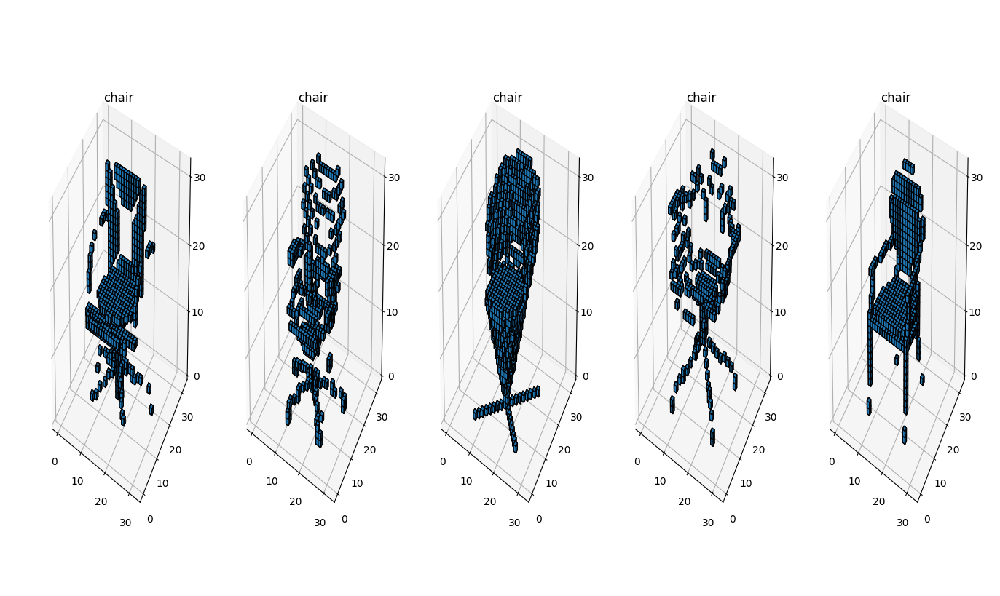
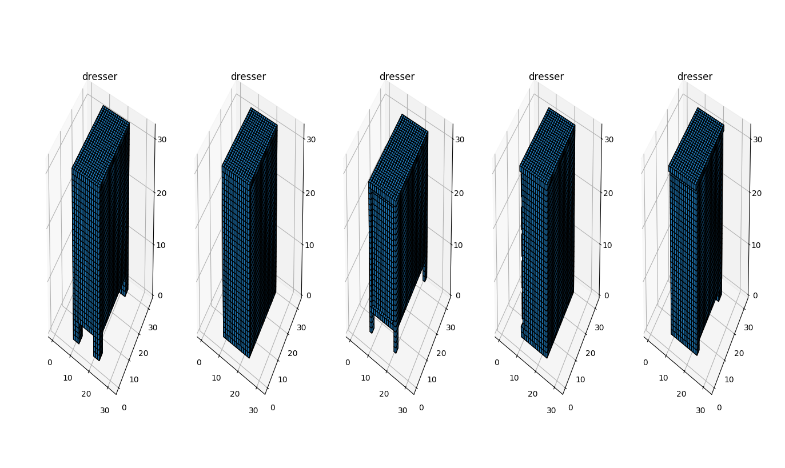
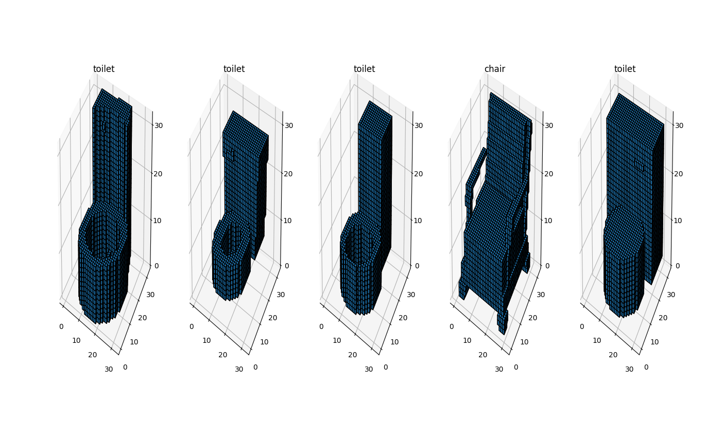

3D Similar Voxel Data Search

This repository is for searching similar voxel data based on features compressed by 3D Convolutional Autoencoder.

## Dependencies
tensorflow, scikit-learn, numpy, matplotlib

My test environment:
Python3.6, tensorflow-gpu==1.12.0, scikit-learn==0.20.3, numpy==1.16.2, matplotlib==3.0.3

## How to use
### 1. Prepare directory
Make sure that directories below exist.
* log
* checkpoint
* data

### 2. Prepare data
Put your MODELNET10 data into data directory. The data should be npz form of array. The original data is available at:

PRINCETON MODELNET
(http://modelnet.cs.princeton.edu/)

### 3. Train 3D CAE
Once array data is prepared, train 3D convolutional autoencoder and the checkpoint will be saved in checkpoint directory.
```
python train.py
```
You can also change training parameters by specifying arguments.

e.g.

```
pyhton train.py --num_epoch 100 --batch_size 32
```
Please look into the script about other settable parameters or
run "python train.py --help"

### 4. Search similar data
Search similar data with the script based on trained model.
```
python evaluate.py
```
In this script, query data is randomly selected by "num_search_sample"(the number of query data) and similar data with numbers specified by "num_top_similarity" will be searched.  
e.g. num_search_sample = 2, num_top_similarity = 3:  
Two query samples and top three similar data by one query will be obtained.

Please look into the script about other settable parameters or
run "python evaluate.py --help"

In the default setting, these result will be displayed with matplotlib. Depending on "num_search_sample" and "num_top_similarity", you might need long time to display.

#### Query samples
##### chair


##### dresser


##### toilet


### Optional
You can also check distribution of encoded features by t-SNE and result of decoded data.
Please activate comment lines in evaluate.py. (in defualt these are commented out)

```
# visualize encoded data with t-SNE
visualize_tsne(encoded, y_test)

# visualize input and its decoded data
visualize_3d_iodata(x_test[sample_idx], decoded[sample_idx], y_test[sample_idx])
```
